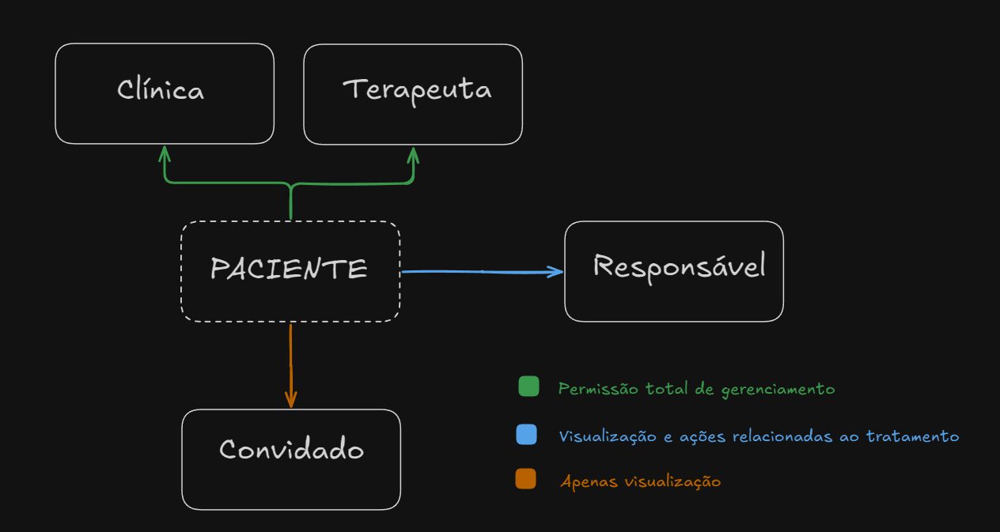

# Paciente

**Descrição Geral:**
O Paciente é o objeto central na plataforma WeCare, servindo como o foco de todas as operações e interações realizadas pelos diferentes tipos de usuários. Ele representa uma pessoa no espectro autista que está sendo acompanhada por profissionais de saúde, com acesso supervisionado e limitado aos responsáveis e convidados.

**Atributos do Paciente:**

1. **Dados Pessoais** - Informações básicas do paciente, como nome, data de nascimento, contato de emergência, entre outros.
2. **Histórico de Saúde** - Inclui histórico de diagnósticos, laudos, tratamentos anteriores e observações médicas.
3. **Plano de Tratamento** - Informações sobre o plano terapêutico ativo, incluindo metas, abordagens terapêuticas, frequência das sessões e outros detalhes.
4. **Documentos e Relatórios** - Armazenamento de documentos relevantes, laudos, avaliações, registros de consultas e outros relatórios.
5. **Avaliações e Registros de Sessões** - Dados coletados nas sessões terapêuticas, incluindo observações dos profissionais e progresso em relação ao plano de tratamento.

### Estrutura do Objeto: Paciente

O objeto **Paciente** é central nas operações do sistema WeCare, concentrando todas as informações relevantes para o acompanhamento e tratamento. Abaixo estão os campos detalhados que fazem parte do objeto **Paciente**.

---

### 1. Identificação Pessoal

- **Nome Completo**: Nome completo do paciente.
- **Data de Nascimento**: Data de nascimento do paciente.
- **Gênero**: Gênero do paciente.
- **Foto de Perfil**: Imagem associada ao paciente para identificação visual.
- **Identificador Único**: ID único para referência do paciente no sistema.

### 2. Informações de Contato

- **Endereço**: Endereço residencial do paciente.
- **Telefone**: Número de telefone para contato.
- **E-mail**: E-mail de contato. (O mesmo usado no cadastro do Responsável)

### 3. Dados Médicos e de Avaliação

- **Diagnóstico**: Diagnóstico específico, incluindo tipo e nível do espectro autista.
- **Histórico Médico Relevante**: Histórico de condições médicas anteriores.
- **Cuidados adicionais**: Alergias ou restrições alimentares
- **Medicamentos e Tratamentos Atuais**: Lista de medicamentos e tratamentos que o paciente está utilizando.
- **Avaliações Periódicas e Resultados**: Registros das avaliações realizadas e seus respectivos resultados.

### 4. Histórico de Tratamento

- **Planos de Tratamento em Andamento**: Descrição dos planos atuais de intervenção.
- **Resumo de Sessões e Atividades Realizadas**: Registro das sessões e atividades que o paciente participou.
- **Metas de Desenvolvimento e Progresso**: Objetivos estabelecidos e progresso alcançado pelo paciente.
- **Notas e Observações dos Terapeutas**: Comentários e observações feitas pelos profissionais de saúde.

### 5. Informações de Responsáveis e Convidados

- **Responsável**: Nome e informações de contato do responsável principal pelo paciente.
- **Convidados Associados**: Lista de convidados autorizados a observar o paciente.
- **Permissões**: Especificações sobre as ações permitidas para o responsável e convidados.

### 6. Dados para Análises e Dashboards

- **Métricas de Progresso**: Indicadores de desenvolvimento, como pontuações e avanços.
- **Dados de Engajamento**: Frequência em sessões e presença nas atividades.
- **Gráficos de Desempenho**: Dados de progresso ao longo do tempo para visualização gráfica.

### 7. Documentos e Anexos

- **Relatórios de Avaliação**: Documentos detalhando as avaliações realizadas.
- **Anamnese**: Documento contendo a anamnese provida pela clínica responsável pelo tratamento.
- **Documentos Médicos e Legais**: Arquivos médicos ou legais relevantes ao tratamento.
- **Outros Anexos**: Materiais adicionais, como atividades personalizadas ou recomendações.

**Permissões de Acesso:**

- **Clínica:**
    - Visualiza e edita todos os dados dos pacientes de sua corporação.
    - Possui controle sobre os registros e atualizações no histórico do paciente.
    - Acesso a relatórios de progresso e dashboards de acompanhamento.
- **Terapeuta:**
    - Visualiza e edita os dados dos pacientes que acompanha.
    - Registra sessões e atualiza o plano de tratamento.
    - Acessa dashboards e relatórios relacionados ao progresso terapêutico.
- **Responsável:**
    - Visualiza o tratamento do paciente, incluindo relatórios e histórico.
    - Pode solicitar documentos adicionais e agendar avaliações.
    - Gerencia o acesso de convidados, com a possibilidade de adicionar ou remover observadores.
- **Convidado:**
    - Apenas visualiza o paciente e os relatórios de tratamento, sem permissão para editar ou interagir com os dados.
    
    
    

### **Fluxo de Criação e Acesso:**

- **Criação:** O Paciente é adicionado à plataforma pela clínica ou terapeuta. No momento da criação, um responsável é vinculado automaticamente, com permissões definidas para visualizar o tratamento e gerenciar convidados.
- **Edição:** Somente a clínica e os terapeutas podem editar o perfil e o plano de tratamento do paciente.
- **Visualização:** O paciente é acessível a todos os usuários relacionados, com restrições de visualização para o responsável e o convidado.

**Considerações para o Sistema:**

- **Segurança e Privacidade:** Dados do paciente devem ser armazenados de forma segura, com controle de acesso granular para cada tipo de usuário.
- **Registros de Ação:** Todas as interações e atualizações no perfil do paciente devem ser registradas para auditoria.
- **Notificações:** Notificações para o responsável, terapeuta e clínica sobre atualizações ou novas ações no perfil do paciente.