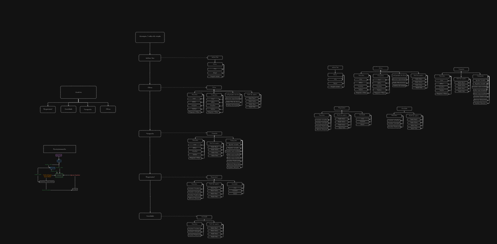

# Personas

### Objetivo

Definir as permissões e funcionalidades específicas para cada persona (tipo de usuário) no sistema WeCare, assegurando que cada perfil tenha acesso adequado aos recursos e dados da aplicação conforme seu papel e responsabilidades, além de especificar a ordem de criação de cada usuário.

---

### Ordem de Criação dos Usuários

1. **WeCare Dev**
    - **Ordem de Criação**: Primeira persona criada no sistema, responsável por criar e gerenciar as **Clínicas**.
    - **Descrição**: O administrador geral do sistema, com poderes para criar, apagar e congelar contas de clínicas.
2. **Clínica**
    - **Ordem de Criação**: Criada pelo WeCare Dev após a solicitação de acesso à plataforma.
    - **Descrição**: A Clínica gerencia diretamente os pacientes e terapeutas, além de poder criar outros terapeutas e configurar especializações e contatos.
3. **Terapeuta**
    - **Ordem de Criação**: Criado pela Clínica dentro de seu painel administrativo.
    - **Descrição**: Cada Terapeuta é responsável pelo acompanhamento dos pacientes e pelo gerenciamento dos dados e documentos do tratamento.
4. **Paciente**
    - **Ordem de Criação**: Criado pelo Terapeuta ou pela Clínica durante o processo de cadastro do paciente.
    - **Descrição**: Paciente é um objeto de acompanhamento dentro do sistema. No momento da criação de um paciente, o sistema gera automaticamente um **Responsável** para gerenciar o acesso e acompanhamento do paciente.
5. **Responsável**
    - **Ordem de Criação**: Criado automaticamente pelo sistema quando um novo Paciente é adicionado.
    - **Descrição**: Este é o usuário primário associado ao paciente, responsável por visualizar o tratamento e gerenciar os Convidados que terão acesso à visualização do progresso do paciente.
6. **Convidado**
    - **Ordem de Criação**: Criado pelo Responsável, que adiciona o Convidado para observar o paciente.
    - **Descrição**: Usuário com permissões limitadas, apenas para visualização do progresso do paciente, sem permissões de edição.

## Wecare Dev → Clínica → Terapeuta → Responsável → Convidado

---

### Personas e Permissões

### 1. **WeCare Dev**

- **Permissões**:
    - Gerenciar as **Clínicas**:
        - Criar novas contas de clínicas.
        - Apagar contas de clínicas.
        - Congelar/desativar o acesso de clínicas.

---

### 2. **Clínica**

- **Permissões**:
    - **Pacientes**:
        - Criar, editar, visualizar, deletar e pesquisar/filtrar pacientes.
    - **Terapeutas**:
        - Criar, editar, visualizar, deletar e pesquisar/filtrar terapeutas.
    - **Configurações da Clínica**:
        - Gerenciar especializações e informações de contato.
    - **Perfil de Usuário**:
        - Atualizar email, senha, nome e foto.

---

### 3. **Terapeuta**

- **Permissões**:
    - **Pacientes**:
        - Criar, editar, visualizar, deletar e pesquisar/filtrar pacientes.
    - **Tratamento**:
        - Agendar consultas, registrar, visualizar e editar consultas.
        - Acessar dashboards e documentos do paciente.
        - Visualizar anamnese.
    - **Perfil de Usuário**:
        - Atualizar email, senha, nome e foto.

---

### 4. **Responsável**

- **Permissões**:
    - **Pacientes**:
        - Visualizar consultas, avaliações e dashboards do paciente.
        - Adicionar anamnese.
    - **Convidado**:
        - Criar, visualizar e excluir Convidados.
    - **Perfil de Usuário**:
        - Atualizar email, senha, nome e foto.

---

### 5. **Convidado**

- **Permissões**:
    - **Pacientes**:
        - Visualizar consultas, avaliações e dashboards.
    - **Perfil de Usuário**:
        - Atualizar email, senha, nome e foto.

---

### Resumo

A ordem de criação dos usuários segue um fluxo hierárquico, começando com o **WeCare Dev** e prosseguindo com a **Clínica**, que cria o **Terapeuta**, que por sua vez pode criar **Pacientes**. A criação do **Responsável** é automática ao cadastrar um Paciente, e este pode adicionar **Convidados** para acompanhamento.

