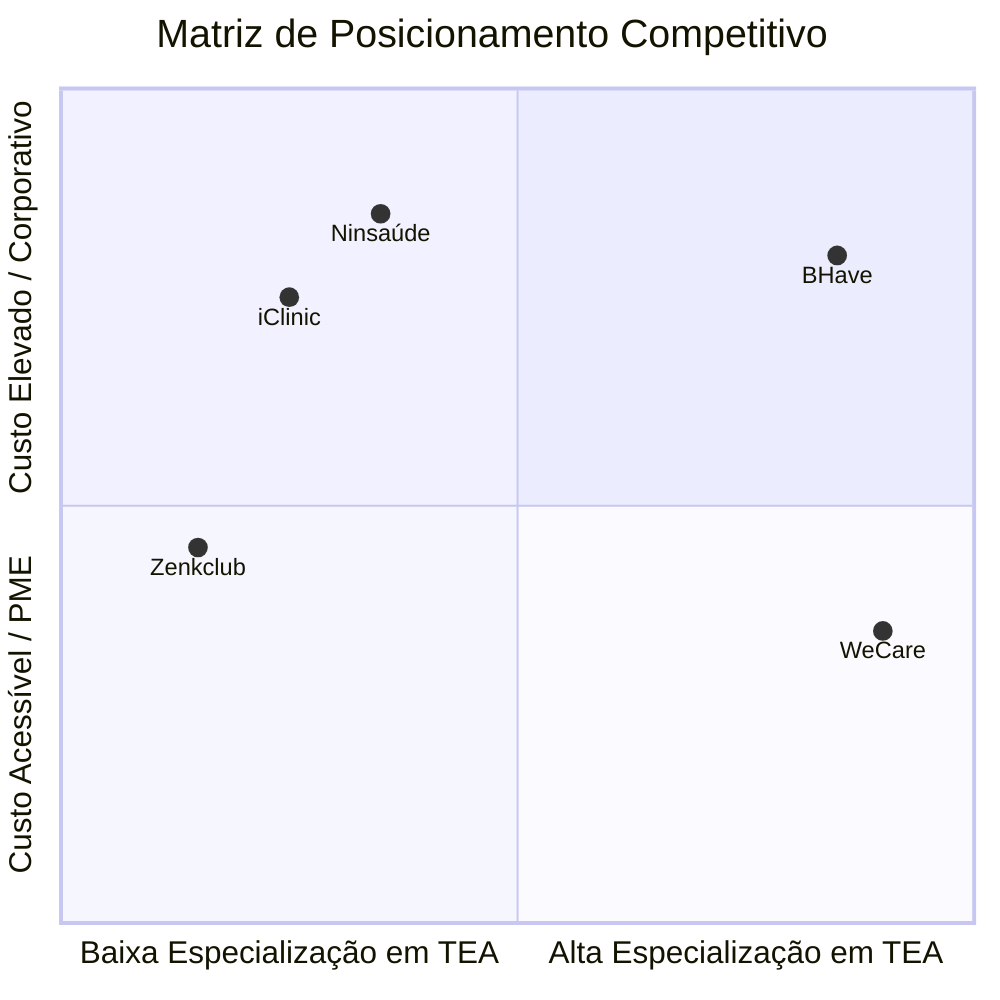

# ⚔️ Análise Competitiva: WeCare no Mercado de Saúde

O WeCare atua em um nicho de alto crescimento e extremamente exigente: sistemas de gestão para clínicas de terapias multidisciplinares focadas no Transtorno do Espectro Autista (TEA). 

Abaixo detalhamos os 4 principais concorrentes (diretos e indiretos) e a nossa estratégia de diferenciação de mercado.

---

## 🔍 1. Mapeamento de Concorrentes

### Competidor 1: BHave (Concorrente Direto)
*   **O que faz:** Plataforma digital consolidada para gestão terapêutica, relatórios clínicos, prontuários eletrônicos e controle de metas para equipes multidisciplinares com foco em autismo.
*   **💪 Pontos Fortes:** Foco clínico muito específico em TEA e ABA; interface otimizada para redução de papel; alta credibilidade de mercado; presença ativa em clínicas de grande porte.
*   **⚠️ Fraquezas:** Custo de mensalidade elevado para clínicas pequenas e de médio porte; baixa customização para realidades e fluxos locais; sistema complexo para equipes menores; baixo foco comercial em clínicas de médio/pequeno porte no interior.
*   **🎯 Estratégia de Combate do WeCare:** Oferecer um ticket médio extremamente competitivo (cerca de R$ 35 por paciente no interior paulista) com foco em simplicidade extrema de uso e onboarding facilitado de 2 horas.

---

### Competidor 2: iClinic (Concorrente Direto de Gestão Médica)
*   **O que faz:** Sistema de prontuário eletrônico, agenda, controle financeiro e telemedicina voltado a consultórios e clínicas médicas generalistas.
*   **💪 Pontos Fortes:** Marca extremamente forte e consolidada no Brasil; integrações robustas; plataforma muito estável e robusta.
*   **⚠️ Fraquezas:** Foco em médicos de atendimento individual (generalista) e não em equipes terapêuticas multidisciplinares de longo prazo; não possui ferramentas para Planos de Ensino Individualizados (PEIs) ou treinos comportamentais (essenciais no autismo); custo por profissional é elevado para clínicas de terapia com equipes rotativas.
*   **🎯 Estratégia de Combate do WeCare:** Posicionar o WeCare como especialista em reabilitação e desenvolvimento infantil multidisciplinar, deixando claro que prontuários médicos tradicionais não atendem às exigências de fonoaudiólogos, psicopedagogos e terapeutas ocupacionais.

---

### Competidor 3: Zenklub (Concorrente Indireto)
*   **O que faz:** Plataforma online de conexão entre pacientes e psicólogos/terapeutas para a realização de consultas individuais remotas (teleconsulta).
*   **💪 Pontos Fortes:** Forte presença digital no B2C e corporativo; marca amplamente conhecida; modelo de agendamento ágil e escalável.
*   **⚠️ Fraquezas:** Foco exclusivo no atendimento individual online; não atende de forma alguma aos fluxos de gestão de equipe interna de clínicas físicas, prontuários sensíveis detalhados ou fluxos de desenvolvimento infantil como o PEI.
*   **🎯 Estratégia de Combate do WeCare:** Demonstrar que o WeCare é o software de gestão interna da clínica que viabiliza o controle técnico e operacional diário, apoiando a equipe multidisciplinar presencial e híbrida, e não uma ferramenta de captação de pacientes avulsos.

---

### Competidor 4: Ninsaúde (Concorrente Direto de Gestão)
*   **O que faz:** Software completo e robusto para clínicas gerais e consultórios, abrangendo prontuários estruturados, agendamento e controle financeiro.
*   **💪 Pontos Fortes:** Funcionalidades administrativas consolidadas; boa aceitação geral de mercado; interface amigável.
*   **⚠️ Fraquezas:** Pouquíssimo foco em clínicas de terapias multidisciplinares; fluxo de prontuário não otimizado para o registro contínuo e evolutivo característico das terapias infantis de TEA.
*   **🎯 Estratégia de Combate do WeCare:** Destacar a nossa usabilidade otimizada que reduz o tempo de digitação de terapeutas em mais de 30% em relação aos concorrentes tradicionais através de modelos de objetivos e treinos estruturados.

---

## 🚀 2. Posicionamento Estratégico do WeCare

| Dimensão | Concorrentes Genéricos | Concorrentes Especializados | Diferencial WeCare |
| :--- | :--- | :--- | :--- |
| **Foco Clínico** | Geral (Médico/Dentista) | TEA e ABA | Multidisciplinar (Psicopedagogia, T.O., Fono) com foco em TEA |
| **Mensalidade** | Custo por Profissional (Alto) | Custo Alto / Corporativo | **Tiers por Pacientes Activos** (Acessível) |
| **Adequação LGPD** | Compartilhada / Geral | Centralizada | **Isolamento de Base/Schemas (Tenant)** |
| **Acesso Família** | Portal do Paciente Básico | Não focado no desenvolvimento | **Portal do Responsável Integrado** (Transparência real) |
