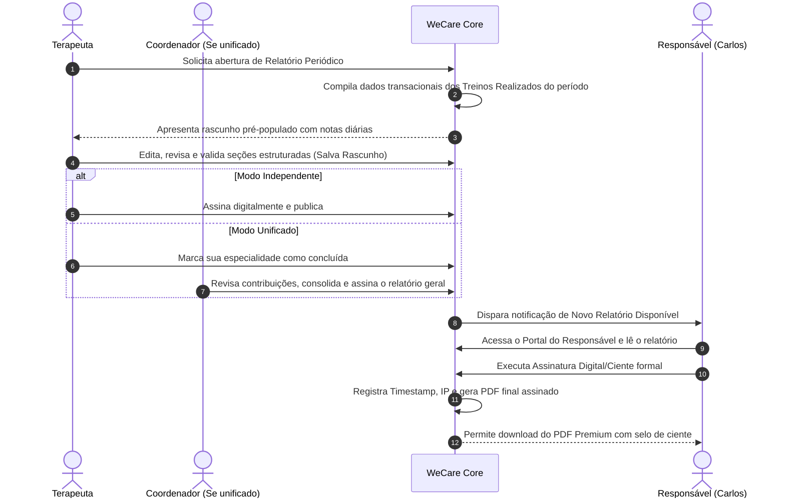

# 📋 Especificação de Requisitos: Devolutivas Periódicas (WeCare)

## 1. Visão Geral e Objetivo
O módulo de **Devolutivas Periódicas** foi concebido para atuar como uma ponte empática, transparente e de alta conformidade legal entre a clínica de reabilitação multidisciplinar (focada em TEA e desenvolvimento infantil) e os responsáveis legais do paciente. 

Este recurso substitui a comunicação fragmentada do WhatsApp e os relatórios "frios" de gráficos avulsos por um fluxo estruturado de **Relatórios Evolutivos Periódicos**, assinados digitalmente pelos terapeutas e validados juridicamente pelos pais.

---

## 2. Regras de Negócio & Configuração do Tenant (Clínica)

A plataforma WeCare apoia múltiplos formatos operacionais de clínicas. As configurações deste módulo residem no nível de **Tenant (Clínica)**:

### 2.1 Modos de Colaboração (Configurável por Clínica)
No painel de configurações da clínica, o administrador poderá escolher entre dois modos de colaboração:
1. **Relatório Clínico Unificado (Multidisciplinar):**
   - Ideal para tratamentos integrados onde o paciente (ex: Lucas) possui múltiplas especialidades (T.O., Psicopedagogia, Fonoaudiologia) na mesma clínica.
   - Cada especialista preenche seus respectivos dados estruturados na mesma "sessão" de rascunho de relatório.
   - Um **Coordenador Clínico** designado realiza a revisão final, encerra o ciclo e assina o relatório consolidado.
2. **Relatórios de Tratamento Independentes:**
   - Cada terapeuta/especialidade atua de forma autônoma.
   - Cada terapeuta gera, revisa, assina e emite seu próprio relatório periódico para a sua especialidade, sem depender dos demais.

### 2.2 Ciclos de Periodicidade Flexíveis
- A frequência de emissão do relatório não é global ou rígida.
- Ela é configurada por **Especialidade** dentro do painel da clínica (ex: Fonoaudiologia = Bimestral; Psicopedagogia = Mensal).
- O sistema alertará o terapeuta no dashboard quando o ciclo de um paciente estiver prestes a vencer para que a elaboração do relatório seja iniciada.

---

## 3. Estrutura de Dados Estruturados (Campos Separados)

Para viabilizar análises históricas futuras, inteligência clínica e geração de tendências, os relatórios periódicos **não** serão armazenados em um único campo de texto livre. A estrutura conterá chaves de dados separadas:

| Campo de Dados | Tipo | Descrição / Regra |
| :--- | :--- | :--- |
| `ResumoClinico` | Texto Estruturado | Análise qualitativa e humana do progresso clínico do paciente no período. |
| `ObjetivosStatus` | JSON / Relacionado | Array de chaves de objetivos mapeados no período (ex: "Coordenação Fina", "Escovar os Dentes"), contendo o status de milestone atual (*Iniciando*, *Em Progresso*, *Conquistado*). |
| `EngajamentoCasa` | Texto Estruturado | Avaliação qualitativa do retorno do treino para casa e adesão da família às orientações. |
| `ProximosPassos` | Texto Estruturado | Planejamento e focos de intervenção terapêutica para o próximo período. |

---

## 4. Fluxo de Trabalho (Workflow)

---

## 5. Portal do Responsável (A UI do Carlos)

Para evitar ansiedade técnica e simplificar a usabilidade da família:
1. **Feed Transacional Diário:** O pai visualiza atualizações simples das sessões (ex: *"Hoje praticamos Coordenação Fina"* e as *"Orientações Práticas para Casa"* escritas de forma acolhedora).
2. **Tela de Devolutivas Periódicas:**
   - Lista histórica dos relatórios assinados.
   - Leitura interativa e amigável na tela das seções estruturadas.
   - **Assinatura Digital / Ciente Formal:** Um fluxo simples de validação digital (ex: confirmação via token de e-mail, senha ou clique com registro robusto de auditoria: CPF, IP, data e hora) que gera o ciente legal.
   - **Download de PDF Premium:** Exportação de um arquivo com layout premium, ideal para apresentar a médicos assistentes, planos de saúde ou escolas.

---

## 6. Segurança, Multi-tenancy e LGPD

1. **Isolamento de Tenant (Base/Schemas):** Os dados e PDFs gerados devem estar rigorosamente isolados na partição/schema de banco de dados correspondente à clínica contratante, impedindo qualquer vazamento ou execução indevida em dados sensíveis de menores.
2. **Logs de Auditoria (Audit Trail):** Todas as visualizações, assinaturas e downloads do relatório devem gerar um log imutável de acesso e auditoria.
3. **Criptografia:** Armazenamento criptografado dos documentos em repouso no Azure Blob Storage.
