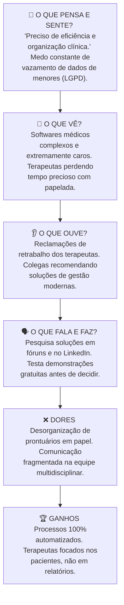
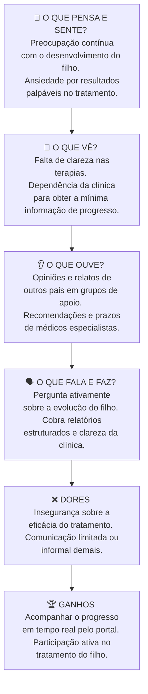

# 👥 Personas e Mapa de Empatia - WeCare

O desenvolvimento do WeCare é norteado por duas personas principais que interagem ativamente com a plataforma, representando os lados clínico e familiar do acompanhamento terapêutico do TEA.

---

## 🧑‍⚕️ Persona 1: O Gestor / Coordenador da Clínica

### Dra. Mariana Costa (38 anos)
*   **Perfil:** Psicóloga e Diretora de uma clínica multidisciplinar de médio porte no interior de São Paulo.
*   **Equipe sob gestão:** 8 terapeutas ativos.
*   **Volume de Pacientes:** Cerca de 60 pacientes com TEA ativos.
*   **Rotina:** Divide seu tempo de forma sobrecarregada entre atendimentos clínicos diretos, gestão administrativa/financeira da clínica e supervisão técnica da equipe terapêutica.

### 🎯 Objetivos da Dra. Mariana
1.  Organizar, padronizar e centralizar os prontuários e Planos de Ensino Individualizados (PEI) de todos os pacientes.
2.  Reduzir o tempo excessivo gasto pela equipe em burocracias de preenchimento e geração de relatórios de evolução.
3.  Garantir conformidade total com a LGPD no armazenamento de dados médicos sensíveis de crianças.
4.  Manter a clínica financeiramente sustentável e com alta retenção de clientes.

### 💔 Dores e Dificuldades
*   Uso de prontuários em papel e planilhas dispersas, gerando perda de histórico de atendimentos.
*   Falta de uma visão consolidada e integrada do progresso global de cada paciente atendido por múltiplos especialistas (ex: fonoaudióloga e terapeuta ocupacional).
*   Insegurança jurídica e administrativa em relação à proteção de dados e vazamentos.

---

## 🗺️ Mapa de Empatia: Dra. Mariana Costa

---

## 👨‍👩‍👦 Persona 2: O Responsável pela Criança com TEA

### Carlos Mendonça (42 anos)
*   **Perfil:** Engenheiro civil, casado, pai do Lucas (7 anos, diagnosticado com TEA moderado).
*   **Rotina:** Trabalha em tempo integral e acompanha o filho nas terapias nos períodos noturnos e finais de semana. É o ponto de contato principal de comunicação e repasse financeiro entre a família e a clínica.

### 🎯 Objetivos do Carlos
1.  Acompanhar de perto a evolução terapêutica real do seu filho.
2.  Entender com clareza o que é trabalhado em cada sessão e como as metas do PEI estão sendo alcançadas.
3.  Obter relatórios claros e estruturados para compartilhar rapidamente com os médicos assistentes e com a escola do Lucas.
4.  Garantir que a clínica está engajada e atuando de forma profissional e transparente.

### 💔 Dores e Dificuldades
*   Sensação constante de "ficar por fora" do tratamento do filho.
*   Recebimento de atualizações esporádicas e informais por mensagens de WhatsApp.
*   Dificuldade de perceber visualmente a evolução e o progresso do filho ao longo de meses.
*   Frustração por ter que solicitar relatórios manualmente para múltiplos especialistas a cada consulta médica.

---

## 🗺️ Mapa de Empatia: Carlos Mendonça

