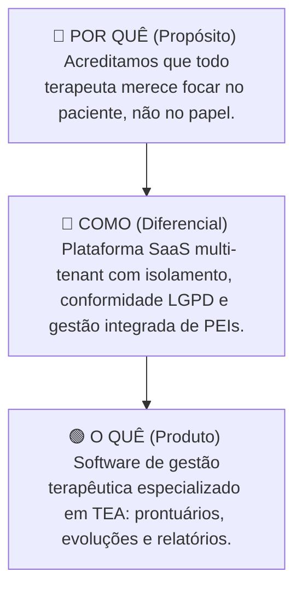

# 🏢 Plano de Negócios WeCare

Este documento reúne a visão estratégica, posicionamento, precificação e o modelo financeiro do **WeCare**, estruturado para atuar como uma plataforma SaaS de alta conformidade e usabilidade em clínicas de terapia para o Transtorno do Espectro Autista (TEA).

---

## 🎯 1. Resumo Executivo & Visão

### O que é o WeCare?
O **WeCare** é uma plataforma **SaaS (Software as a Service) multi-tenant** desenvolvida em `.NET 9` e `C#` focada na gestão integrada e no acompanhamento terapêutico de indivíduos com TEA. O sistema garante o isolamento lógico das bases de dados por clínica (tenant), garantindo total privacidade, conformidade regulatória e segurança robusta.

### O Problema (O Porquê)
Profissionais da área da saúde multidisciplinar (psicólogos, terapeutas ocupacionais, fonoaudiólogos) que acompanham casos de TEA lidam diariamente com um volume massivo de dados clínicos sensíveis. A criação de **Planos de Ensino Individualizados (PEIs)**, o registro de evoluções diárias e a análise de métricas comportamentais frequentemente ocorrem em papel ou planilhas dispersas. Isso consome tempo precioso das terapias, dificulta a colaboração multidisciplinar e aumenta o risco de perda ou vazamento de dados de saúde.

### A Oportunidade
O mercado carece de soluções especializadas e acessíveis que otimizem o tempo dos terapeutas e garantam conformidade integral com a **LGPD (Lei Geral de Proteção de Dados)**. Ao centralizar prontuários, evoluções diárias e a comunicação direta com os familiares em um único local, o WeCare permite que o foco da equipe volte-se integralmente ao paciente e não à burocracia.

---

## 🌟 2. Círculo Dourado (Golden Circle)

---

## 🎨 3. Business Model Canvas

| Parcerias-Chave | Atividades-Chave | Propostas de Valor | Relacionamento | Segmentos de Clientes |
| :--- | :--- | :--- | :--- | :--- |
| • Clínicas e centros de atendimento TEA. • Terapeutas, psicólogos e fonoaudiólogos. • Fornecedores de infraestrutura em nuvem (Azure). • Associações de autismo. | • Desenvolvimento e suporte da plataforma. • Onboarding e treinamento de equipes. • Campanhas de marketing e vendas focadas no interior. | • **Gestão Eficiente:** Organização centralizada de prontuários e PEIs. • **Transparência:** Acesso facilitado e relatórios claros para os pais. • **Segurança:** Isolamento rígido de dados (LGPD). | • Suporte direto (humano e consultivo). • Canal direto para dúvidas e treinamentos. • Eventos educacionais e webinars técnicos. | • **Gestores de Clínicas:** Decisores de tecnologia e infraestrutura. • **Terapeutas:** Usuários diários de prontuários. • **Responsáveis:** Acompanhamento da evolução terapêutica. |
| **Recursos-Chave** | | **Canais** | | **Estrutura de Custos** |
| • Plataforma web (.NET) e SQL Server. • Equipe multidisciplinar (Devs, UX/UI, Suporte). • Infraestrutura escalável em nuvem. | | • Venda direta e prospecção ativa. • Grupos fechados de terapeutas TEA. • Conteúdo educativo e LinkedIn. | | • Hospedagem e infraestrutura (Azure). • Ferramentas de suporte e envio de e-mails (SendGrid). • Salários da equipe e custos fiscais. |

---

## 💰 4. Modelo de Precificação & Tiers SaaS

Para garantir a viabilidade financeira e eliminar faturas flutuantes por paciente individual, a precificação do WeCare foi estruturada em faixas (Tiers) de capacidade ativa:

> [!NOTE]
> **Taxa de Implantação (Setup Fee):** Cobrança única de **R$ 800** no momento da assinatura para cobrir custos de onboarding assistido (mínimo de 2 horas) e parametrização inicial da clínica.

### Tabela de Planos e Tiers
| Plano / Tier | Capacidade da Clínica | Mensalidade (Billed Monthly) | Plano Anual (15% de Desconto) |
| :--- | :--- | :--- | :--- |
| **Starter** | Até 15 pacientes ativos | R$ 1.100 / mês | R$ 11.220 / ano (Pago à Vista) |
| **Growth** | Até 30 pacientes ativos | R$ 2.100 / mês | R$ 21.420 / ano (Pago à Vista) |
| **Scale** | Até 50 pacientes ativos | R$ 3.200 / mês | R$ 32.640 / ano (Pago à Vista) |

---

## 📉 5. Planejamento Financeiro & Ponto de Equilíbrio (Break-Even)

O planejamento de custos fixos e break-even do WeCare está dividido em duas fases operacionais:

### Custos Fixos Mensais
*   **Fase 1 (Mês 1 ao 3 - Sem Retirada de Equipe):** R$ 2.078 a R$ 2.478 / mês.
    *   *Azure (Hospedagem + DB):* R$ 800 - R$ 1.200
    *   *Ferramentas (GitHub, etc.):* R$ 78
    *   *Marketing Digital:* R$ 500
    *   *Serviços (Contabilidade + Jurídico):* R$ 600
*   **Fase 2 (Mês 4+ - Com Remuneração da Equipe):** R$ 24.638 a R$ 25.238 / mês (Incluindo folha de pagamento de R$ 21.780 para 5 sócios fundadores).

### Análise de Break-Even
*   **Fase 1:** Necessita de apenas **3 clínicas** no plano *Starter* (mensal) ou **1 venda anual** do plano *Starter* para cobrir a infraestrutura técnica.
*   **Fase 2:** Requer **12 clínicas** ativas no Tier *Growth* para sustentar a operação completa com salários dos fundadores integrados.
