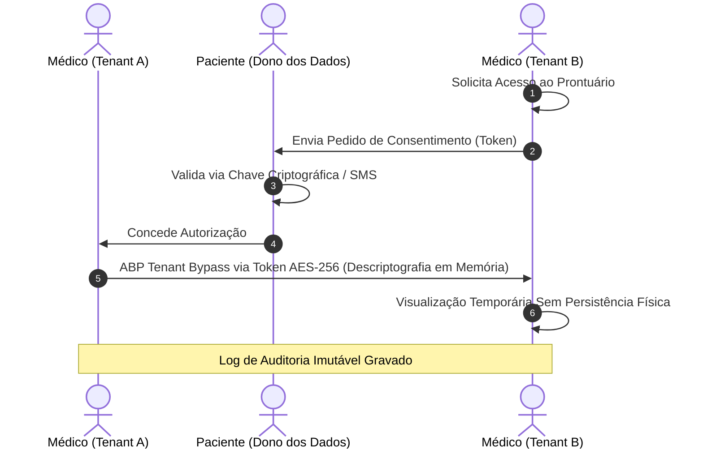
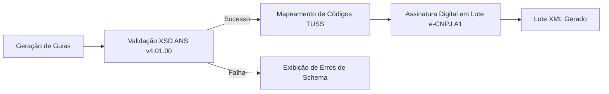
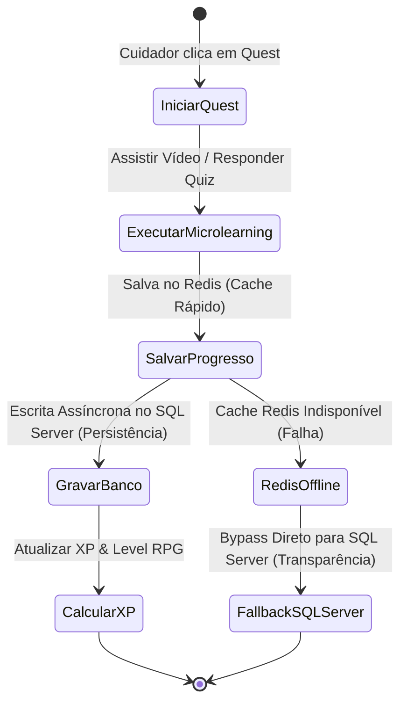

# 📋 Plano de Testes Mestre (Master QA & Visual Test Plan) — WeCare

## 1. Introdução e Objetivos de Qualidade

Este documento estabelece o **Plano de Testes Mestre (Master Test Plan)** para a plataforma WeCare, englobando as recentes entregas críticas de arquitetura clínica e faturamento de planos. A estratégia de QA combina **Testes de Aceitação Funcionais (E2E)**, **Testes Não-Funcionais (Segurança, Criptografia e Performance)** e **Auditoria Visual Automatizada** com foco na estética glassmorphic e micro-animações.

### Critérios de Aceitação de Qualidade (QA Gateways)
*   **Cobertura Funcional:** 100% dos fluxos críticos descritos neste plano devem ser exercitados pelo pipeline automatizado.
*   **Erros em Console/Rede:** Zero logs de `console.error` ou requisições `HTTP >= 400` nos fluxos auditados.
*   **Layout & Alinhamento:** Desvio máximo de layout de `0px` para sobreposição de elementos interativos e zero scrollbars horizontais indesejadas.
*   **LGPD & Privacidade:** Zero dados sensíveis expostos em texto claro em trânsito, banco de dados ou logs do sistema.

---

## 2. Cenários: Prontuário Multidisciplinar Cross-Tenant com Consentimento LGPD Dinâmico

Esta funcionalidade gerencia o compartilhamento seguro de prontuários clínicos entre diferentes clínicas (Tenants) mediante consentimento expresso e auditável do paciente.



### 2.1. Casos de Teste Funcionais (E2E)
*   **TC-LGPD-001: Solicitação e Autorização Cross-Tenant Bem-Sucedida**
    *   **Pré-condições:** Paciente cadastrado no Tenant A; Médico autenticado no Tenant B.
    *   **Passos:** 
        1. Médico do Tenant B solicita acesso ao prontuário do Paciente informando CPF.
        2. Paciente acessa o portal de consentimento e aprova a solicitação com assinatura digital de consentimento.
        3. Médico do Tenant B tenta acessar o prontuário.
    *   **Resultado Esperado:** O sistema realiza o bypass seguro do filtro de Tenant do ABP Framework via Token dinâmico e exibe o prontuário no Tenant B por período delimitado.
*   **TC-LGPD-002: Rejeição de Acesso sem Consentimento Ativo**
    *   **Passos:**
        1. Médico do Tenant B tenta acessar a rota direta `/Patients/MedicalRecord/{id}` injetando IDs de outros tenants.
    *   **Resultado Esperado:** O sistema bloqueia a requisição imediatamente retornando `HTTP 403 Forbidden` ou redireciona para a página de solicitação de consentimento.
*   **TC-LGPD-003: Revogação Dinâmica de Consentimento**
    *   **Passos:**
        1. Paciente entra em seu painel LGPD e clica em "Revogar Acesso" para o Tenant B.
        2. Médico do Tenant B tenta atualizar ou recarregar a visualização do prontuário.
    *   **Resultado Esperado:** A permissão é invalidada instantaneamente e a sessão de visualização expira imediatamente (bloqueando requisições subsequentes à API clínica).

### 2.2. Casos de Teste de Segurança e Criptografia (Não-Funcionais)
*   **TC-SEC-001: Criptografia em Trânsito e Repouso (AES-256 Zero-Knowledge)**
    *   **Validação:** Interceptação de requisições HTTPS e leitura direta do banco de dados (tabela de prontuários).
    *   **Resultado Esperado:** Dados clínicos sensíveis (anamnese, diagnósticos) devem estar totalmente ilegíveis em repouso e trânsito. A descriptografia ocorre estritamente *em memória* do lado do cliente com a chave fornecida pelo token de consentimento.
*   **TC-SEC-002: Expirabilidade Criptográfica de Tokens**
    *   **Validação:** Criação de token de consentimento com TTL de 5 minutos.
    *   **Resultado Esperado:** Transcorridos 5 minutos e 1 segundo, qualquer tentativa de descriptografar dados usando a chave/token gera exceção criptográfica e nega o acesso.
*   **TC-SEC-003: Logs de Auditoria LGPD Imutáveis**
    *   **Validação:** Executar bypass de tenant e verificar gravação de logs de auditoria do ABP.
    *   **Resultado Esperado:** Cada consulta cross-tenant deve gerar um registro de log contendo: CPF do paciente, ID do médico requisitante, carimbo de data/hora UTC, ID do token de consentimento e hash SHA-256 da transação de acesso. O log não deve conter dados clínicos descriptografados.

---

## 3. Cenários: Faturamento de Planos XML TISS/TUSS com e-CNPJ A1

Faturamento e exportação de guias de saúde eletrônicas padrão TISS/TUSS da ANS, assinadas digitalmente com certificados e-CNPJ A1 (RSA-SHA256).



### 3.1. Casos de Teste Funcionais e Validação de Schema
*   **TC-TISS-001: Validação de Schema XSD ANS (v4.01.00)**
    *   **Pré-condições:** Guias de consulta preenchidas no painel de faturamento.
    *   **Passos:** 
        1. Clicar em "Gerar Lote TISS XML".
    *   **Resultado Esperado:** O XML é gerado em total conformidade com a versão v4.01.00 da ANS. Validação contra o schema XSD oficial deve passar com 100% de integridade estrutural.
*   **TC-TISS-002: Mapeamento de Códigos de Procedimento TUSS**
    *   **Passos:**
        1. Inserir um procedimento interno da clínica.
        2. Verificar a codificação correspondente exportada no XML.
    *   **Resultado Esperado:** O mapeamento DE-PARA para a tabela TUSS correspondente deve ser validado (ex: procedimento "Fisioterapia Respiratória" deve converter rigorosamente para o código TUSS `20103115`).
*   **TC-TISS-003: Tratamento de Erros Estruturais no XML**
    *   **Passos:**
        1. Tentar exportar um lote de guias onde faltem campos obrigatórios (ex: número da carteira do beneficiário).
    *   **Resultado Esperado:** O sistema bloqueia a geração, exibe alertas amigáveis na UI apontando a guia e o campo ausente, e impede a exportação de arquivos corrompidos.

### 3.2. Casos de Teste de Criptografia e Assinatura (e-CNPJ A1)
*   **TC-SIGN-001: Assinatura Digital RSA-SHA256 em Lote**
    *   **Validação:** Processamento com simulador mock de certificado A1.
    *   **Resultado Esperado:** A tag `<Signature>` do XML é preenchida corretamente com o hash RSA-SHA256 contendo a assinatura digital válida baseada no certificado e-CNPJ A1.
*   **TC-SIGN-002: Validação da Cadeia do Certificado**
    *   **Validação:** Tentar assinar um lote usando um certificado expirado ou revogado na ICP-Brasil.
    *   **Resultado Esperado:** O sistema rejeita o certificado, aborta o processamento da assinatura e exibe erro amigável na tela indicando a expiração.

---

## 4. Cenários: Trilha Gamificada de Micro-Learning para Cuidadores com Redis

A jornada de aprendizado gamificada recompensa cuidadores por assistir a pílulas de conhecimento sobre cuidados paliativos e gerontologia.



### 4.1. Casos de Teste de Mecânicas RPG (Gamificação)
*   **TC-GAME-001: Progresso de Quest Familiar e Recompensa**
    *   **Passos:**
        1. Cuidador conclui um módulo de leitura/vídeo sobre "Manejo de Escaras".
    *   **Resultado Esperado:** A quest é marcada como concluída na UI. A barra de progresso enche suavemente via micro-animação CSS, e o XP correspondente é creditado ao perfil do cuidador.
*   **TC-GAME-002: Cálculo Dinâmico de XP e Level Up**
    *   **Passos:**
        1. Acumular XP suficiente para ultrapassar o threshold do nível atual (ex: passar de 1000 XP).
    *   **Resultado Esperado:** O nível do cuidador é incrementado em tempo real, exibindo animação e comemorativo de "Level Up", sem interrupções visuais ou travamentos na página.

### 4.2. Casos de Teste de Performance e Fallback Redis
*   **TC-REDIS-001: Validação de Cache Hit / Cache Miss**
    *   **Validação:** Acompanhamento de requisições de progresso do cuidador.
    *   **Resultado Esperado:** 
        - **Cache Hit:** Leituras subsequentes da trilha gamificada devem responder em `< 5ms` diretamente do Redis Cache.
        - **Cache Miss:** Quando expirado o cache, busca no SQL Server, popula o Redis e retorna os dados de forma transparente.
*   **TC-REDIS-002: Failover Automático com Fallback para SQL Server**
    *   **Pré-condições:** Simular a queda física do Redis Server durante uma sessão activa.
    *   **Passos:**
        1. Desconectar/derrubar a instância do Redis.
        2. O cuidador conclui uma quest no micro-learning.
    *   **Resultado Esperado:** O sistema detecta a falha de conexão do Redis de forma silenciosa, realiza o **fallback automático** e imediato para gravação direta no banco SQL Server. Nenhuma tela de erro deve ser exibida ao usuário.
*   **TC-REDIS-003: Recuperação de Conexão e Sincronização (Warm-up)**
    *   **Passos:**
        1. Reestabelecer o Redis Server.
        2. Atualizar a página de trilha de micro-learning.
    *   **Resultado Esperado:** O cache Redis é reconectado automaticamente, re-hidratado com o estado atualizado do SQL Server (warm-up), e volta a responder prioritariamente de forma transparente.

---

## 5. Cenários de Teste Visual & Interface de Usuário (Aparência & Sensação)

Auditando a qualidade visual da aplicação e garantindo conformidade estética estrita com os padrões modernos estabelecidos no WeCare.

### 5.1. Estética Glassmorphic (Transparências e Contraste)
*   **TC-VIS-001: Verificação de Backdrop-Filter Blur**
    *   **Assert:** Elementos com classe `.glass-card` ou contêineres sobrepostos.
    *   **Resultado Esperado:**
        - Propriedade CSS `backdrop-filter: blur(10px...20px)` aplicada e renderizada corretamente.
        - Cor de fundo translúcida com opacidade RGBA balanceada (ex: `rgba(255, 255, 255, 0.4)`).
        - **Contraste de Texto:** O contraste entre textos clínicos sobrepostos e o fundo dinâmico e translúcido deve respeitar a norma WCAG (mínimo de `4.5:1` para texto normal).
*   **TC-VIS-002: Detecção de Elementos Órfãos / Detached Modals**
    *   **Assert:** Modais de Tenant e dropdowns abertos.
    *   **Resultado Esperado:** Sombras (`box-shadow`) adequadas para criar profundidade tridimensional sobre o fundo glassmorphic, sem sobreposição opaca agressiva.

### 5.2. Micro-animações e Interações Dinâmicas
*   **TC-VIS-003: Preenchimento de Barra de Progresso e Level Up**
    *   **Assert:** Transições de conclusão de quests.
    *   **Resultado Esperado:** Animação linear fluida de preenchimento (`transition: width 0.8s ease-in-out`), sem travamentos de frame (FPS estável em `60fps`).
*   **TC-VIS-004: Hover de Cartões e Botões de Quest**
    *   **Resultado Esperado:** Elevação leve e transição suave de cor/sombra ao passar o mouse (`transition: transform 0.2s, box-shadow 0.2s`), proporcionando feedback tátil sutil ao usuário.

### 5.3. Paginação e Ausência de Scrollbars Indesejadas
*   **TC-VIS-005: Supressão Absoluta de Scrollbars Horizontais**
    *   **Assert:** Visualização de listagens longas e calendário clínico em resoluções de `1280px` a `1920px`.
    *   **Resultado Esperado:** `overflow-x: hidden` deve estar active nos contêineres principais de layout. Nenhuma barra de rolagem horizontal órfã deve aparecer nas bordas inferiores dos cartões ou tabelas de prontuário.
*   **TC-VIS-006: Layout de Paginação e Quebras de Grid**
    *   **Assert:** Rodapé de tabelas de prontuário e lista de pacientes.
    *   **Resultado Esperado:** Os botões de paginação devem estar centralizados ou alinhados à direita, respeitando margens simétricas (`margin-top: 16px...24px`), sem quebrar a linha de forma desalinhada em viewports padrão.

---

## 6. Estratégia de Automação com Playwright

Todas as asserções visuais e funcionais listadas acima serão automatizadas utilizando a infraestrutura criada na pasta `tests/WeCare.VisualTests/`.

### Configurações Técnicas de Execução
```javascript
// Exemplo de integração no run-pipeline.js para verificação de fallbacks e tolerância
const { test, expect } = require('@playwright/test');

test('Verifica integridade do faturamento XML TISS contra XSD', async ({ page }) => {
  await page.goto('https://localhost:44373/Billing');
  await page.click('#generate-tiss-xml');
  
  // Captura downloads e valida schemas localmente usando bibliotecas nativas
  const download = await page.waitForEvent('download');
  const path = await download.path();
  
  // Chamada de asserção estrutural
  const xmlIsValid = validateXmlAgainstXsd(path, 'xsd/ans_tiss_v4_01_00.xsd');
  expect(xmlIsValid).toBe(true);
});
```

*   **Validação Visual de Regressão por Imagem:** O Playwright executará capturas de tela automatizadas (`page.screenshot`) comparando screenshots de referência (baseline) contra a execução em tempo real utilizando tolerância de pixel ajustada de `0.05%`.
*   **Monitoramento de Logs e Erros:** O script de automação rejeitará builds que gerem qualquer erro de rede não tratado ou vazamento de logs confidenciais no console.
